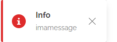

# toasterjs

## toaster messages for your  frontend

**Simply add this lib  with**

` `

**create an object whenaewer you want**

` `
  
  **Simply call an object when needed**
  
  `toaster.theToast(message,type)`
  
  **type**
  MSG_ERROR = 1;
  MSG_WARNING = 2;
  MSG_SUCCESS = 3;
  MSG_INFO = 4;
